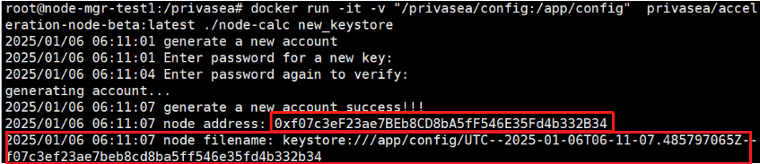
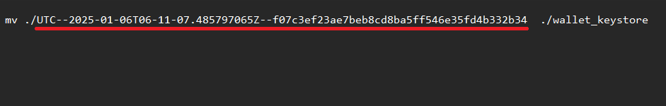
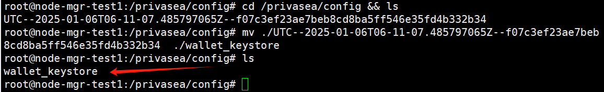
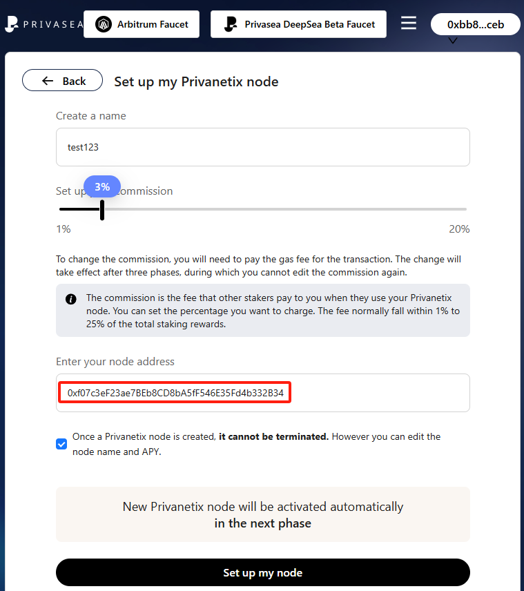

# Recommended Configurations
| SPECS | LEVEL 1 | LEVEL 2 | LEVEL 3 | LEVEL 4 |
|-------------|-------------|-------------|-------------|-------------|
| OS | Debian/Ubuntu | Debian/Ubuntu | Debian/Ubuntu | Debian/Ubuntu |
| Storgae | 100GB available | 100GB available | 100GB available | 100GB available |
| Processor | 16 cores and above| 8 cores and above | 4 cores and above| 4 cores and below  |
|Memory| 8GB and above|4GB and above| 4GB|4GB and Below|
|Port|Open TCP port 8181 |Open TCP port 8181 |Open TCP port 8181 |Open TCP port 8181 |
|Network| Public static IP|Public static IP|Public static IP|Public static IP|
|Weight Coefficient|2x|1.5x|1.2x|1x|

### Some Tips choosing the right VPS server: 
Device performance impacts your PoW rewards. Rewards are calculated using the following formula:

​Points = Weight Coefficient x Uptime Percentage

Tasks are completed randomly and during that time if you node failed to complete the task, your node will be considered as Level 4 even though your node meets the Level 1,2, or 3 configuration. So Make sure you choose a stable server such as 'Hetzner' during purchasing any VPS.

# Setup Guide
## Step 1: Install Docker
If Docker is already installed, you can skip this step. Otherwise follow these commands. 
<pre><code>sudo apt update && apt upgrade -y</code></pre>
<pre><code>sudo apt install docker.io</code></pre>
<pre><code>sudo apt update</code></pre>
Now verify if docker is installed sucessfully using following command
<pre><code>sudo docker --version</code></pre>
You will see output similar to the following image if docker is installed correctly.

   

## Step 2: Enable Docker Service
<pre><code>sudo systemctl start docker
sudo systemctl enable docker</code></pre>

## Step 3: Pull Docker Mirroring
<pre><code>sudo docker pull privasea/acceleration-node-beta</code></pre>

## Step 4: Creating Directory
First switch to root user (For most, root is automatically selected). 
<pre><code>sudo su</code></pre>
Enter your machine password to confirm.

   

Now let's create a directory for running the node program.
<pre><code>mkdir -p  /privasea/config && cd  /privasea</code></pre>

## Step 5: Creating Keystore File
Execute the following command to generate a new Keystore file.
<pre><code>sudo docker run -it -v "/privasea/config:/app/config"  \
privasea/acceleration-node-beta:latest ./node-calc new_keystore</code></pre>
__It will ask you to enter a password.__ Password won't show. So just make sure you put same passowrd to cofirm it.
### Remember this password. You will need this password later.

## Step 6: Edit the Keystore File.
First things first, open a Notepad. Now copy your node address (You will need this address to register/edit your node in the dashboard) and your node filename (You will need this to edit Keystore) as shown in the screenshot and paste it in a nodepad.

   

Now in the notepad paste this command. We will edit this command.
<pre><code>mv ./UTC--2025-01-06T06-11-07.485797065Z--f07c3ef23ae7beb8cd8ba5ff546e35fd4b332b34  ./wallet_keystore</code></pre>
Now replace 'UTC--2025-01-06T06-11-07.485797065Z--f07c3ef23ae7beb8cd8ba5ff546e35fd4b332b34' with your own Keystore file.

   

## Step 7: Run the edited commands.
First change the directory
<pre><code>cd /privasea/config</code></pre>
__Now send the Keystore command that you have edited in previous step.__
Check if the file edited correctly using
<pre><code>ls</code></pre>
Check if your output is same as below screenshot

   

## Step 8: Start the Node
Before sending the command, make sure you changed the password with your own password which you have set during step 5.
<pre><code>cd /privasea/
sudo docker run  -d   -v "/privasea/config:/app/config" \
  -e KEYSTORE_PASSWORD=123456 \
  privasea/acceleration-node-beta:latest</code></pre>

### Your node should be running now. 

## Step 9: Register Your Node in Deepsea Dashboard.
1. Go to [DeepSea dashboard](https://deepsea-beta.privasea.ai/privanetixNode)
2. Click on Set up now if you did not registered your node before or Edit node if you already have a registered node.
3. Give your node a name and choose commission fee.
4. In the node address, paste your node address from step 6.
5. Click confirm.

   

